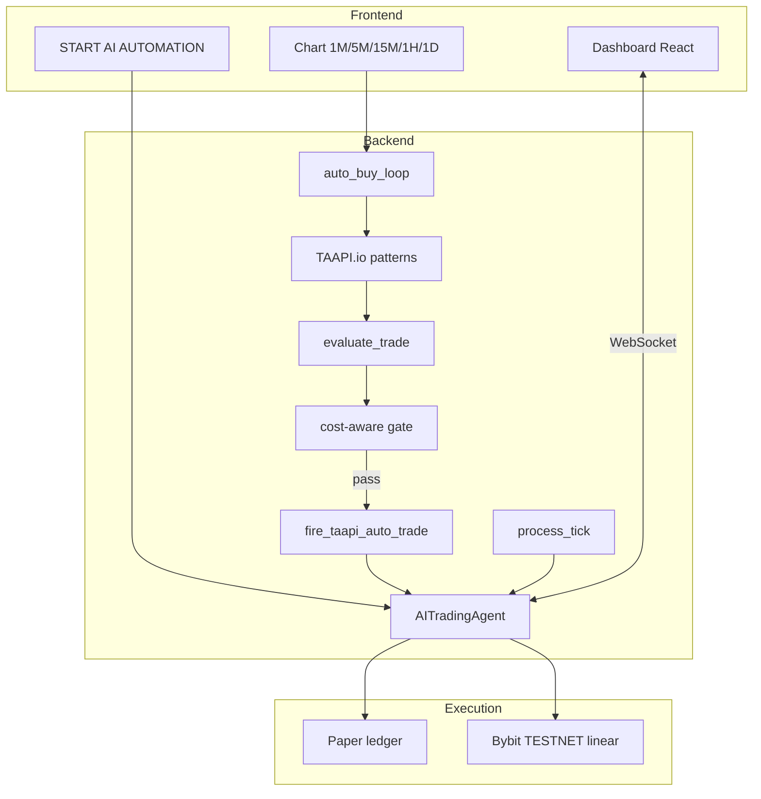

# AI Trading Bot — Full Strategy Reference

> **System Role & Identity:** See [`DATA/SYSTEM_ROLE_AND_IDENTITY.md`](DATA/SYSTEM_ROLE_AND_IDENTITY.md) and [`DATA/SMC_ICT_MARKET_STRUCTURE.md`](DATA/SMC_ICT_MARKET_STRUCTURE.md) for AI agent training (SMC / ICT / market structure — not shown in UI).

This document describes the **complete trading strategy** implemented in this repository as of the current codebase (`backend/main.py`, `volume_spread_system.py`, `trading_policy.py`, `bybit_executor.py`).

---

## 1. Strategy overview

| Item | Value |
|------|--------|
| **Style** | Rule-based **TAAPI candlestick patterns** (not ML hourly forecast) |
| **Asset focus** | **One active pair** at a time (e.g. BTC/USDT) |
| **Direction** | TAAPI **BUY → LONG**, TAAPI **SELL → SHORT** (direct mapping) |
| **Entry trigger** | New **closed candle** on selected chart timeframe |
| **Exit trigger** | **Fixed take-profit** on gross PnL (no exchange SL/TP orders) |
| **Sizing (auto)** | **2% of portfolio** per TAAPI-fired trade |
| **Sizing (manual)** | **1% margin × 100× leverage** |
| **Hedging** | **Not allowed** — opposite auto positions are closed before flip |

---

## 2. High-level architecture



---

## 3. Operating modes

### 3.1 Paper trading (default)

- Positions are **simulated** in `AITradingAgent` (`exchange: "paper"`).
- Bybit market open/close is **logged only** (no real orders).
- Capital ledger: `agent.current_capital` (default start $1,000).
- Chart live price: backend `/ws/market` (Bybit spot ticker ~1.5s).

### 3.2 Live / Bybit TESTNET

- Requires `BYBIT_TESTNET_API_KEY` + `BYBIT_TESTNET_API_SECRET` in `backend/.env`.
- Real orders via `bybit_executor.BybitAgent` (USDT **linear perpetual**, market orders).
- Local dashboard registers fills with `exchange: "bybit_linear_testnet"`.
- Closes use **reduce-only** market orders.
- **Same entry/exit rules** as paper — only execution differs.

### 3.3 What is NOT in the live loop

| Component | Status |
|-----------|--------|
| **Z.ai / GLM-4.5-Flash** | Configured for **Settings → Test AI** only; **does not** approve or block TAAPI trades |
| **ML XGBoost / LSTM** | Not used |
| **Exchange-side SL/TP** | Not attached to orders |
| **Portfolio 2.5% kill switch** | **Disabled** (manual STOP still closes all) |

---

## 4. User workflow (before bot runs)

1. User clicks **START AI AUTOMATION**.
2. **AI Agent Instructions** modal:
   - **Risk level %** (0.5–100%) → `max_concurrent_trades = round(risk × 1.5)`
   - **Daily profit %** (optional, stored; full enforce TBD)
3. **Final safety check** → POST `/agent/config` then POST `/start-bot`.
4. `agent.is_active = true` → `auto_buy_loop` begins scanning.

---

## 5. Signal pipeline (`auto_buy_loop`)

Runs continuously while `agent.is_active` and not in emergency halt.

### 5.1 Poll interval

| Chart TF | Sleep between scans |
|----------|---------------------|
| 30s, 1m | 5 seconds |
| 5m, 15m | 15 seconds |
| 1h, 1D | 30 seconds |

### 5.2 Per-candle sequence

1. Fetch **last closed candle** OHLC from Bybit **linear** klines (`fetch_closed_candle_ohlc`).
2. **Skip** if this candle `close_time` was already processed (`LAST_CANDLE_TIMESTAMPS`).
3. **TAAPI bulk scan** — 30 candlestick patterns via `fetch_taapi_signals()`.
4. **Decision** — `evaluate_trade(signals, timeframe, high, low)`.
5. **Cost-aware gate** — `evaluate_cost_aware_entry()` (`trading_policy.py`).
6. **Capital check** + `compute_auto_trade_plan()` (2% sizing).
7. **`fire_taapi_auto_trade()`** — open position (paper or TESTNET).

---

## 6. TAAPI patterns (30 total)

Defined in `backend/taapi_scanner.py` → `TAAPI_PATTERNS`.

| Type | Examples | TAAPI action |
|------|----------|--------------|
| Bullish reversal | hammer, morningstar, 3whitesoldiers | BUY |
| Bearish reversal | hangingman, shootingstar, eveningstar | SELL |
| Both-direction | engulfing, harami, belthold | BUY if value=+1, SELL if value=-1 |

**TAAPI exchange:** defaults to `binance` (config `TAAPI_EXCHANGE`) — correlated stand-in for Bybit on free plans.

**Rate limit:** 2 bulk batches, `TAAPI_BATCH_DELAY_SECONDS` (default 16s) between batches.

---

## 7. Trade decision rules (`evaluate_trade`)

### 7.1 Conflict rule

If **both** bullish and bearish patterns fire on the same candle → **`NO_TRADE`** (conflicting signals).

### 7.2 Signal selection

First non-zero pattern in scan list wins (after conflict check, all active signals share the same sign).

### 7.3 Price geometry (boundary rules)

Let `buffer = candle_low × buffer_pct` (from `TIMEFRAME_RULES`).

| TAAPI action | Entry | Stop (reference) | Take-profit |
|--------------|-------|------------------|-------------|
| **BUY** | `candle_high + buffer` | `candle_low - buffer` | `entry × (1 + gross_tp)` |
| **SELL** | `candle_low - buffer` | `candle_high + buffer` | `entry × (1 - gross_tp)` |

**Note:** SL levels are computed for reference; **no automatic stop-loss exit** — exits are profit-book only.

### 7.4 TAAPI → position side

| TAAPI | Position | Bybit order (TESTNET) |
|-------|----------|------------------------|
| BUY | **LONG** | Buy |
| SELL | **SHORT** | Sell |

---

## 8. Timeframe matrices

### 8.1 TAAPI scan interval map

| Dashboard TF | TAAPI API interval |
|--------------|-------------------|
| 1M | 1m |
| 5M | 5m |
| 15M | 15m |
| 1H | 1h |
| 1D | 1d |

Chart timeframe sync: frontend POST `/set-timeframe` → `agent.timeframe_seconds` + clears candle timestamps.

### 8.2 Planned TP from `TIMEFRAME_RULES` (evaluate_trade)

Values are **shifted** (1m inherits old 30s row). Gross TP = decimal fraction (×100 for %).

| TF key | gross_tp | net_profit target | buffer |
|--------|----------|-------------------|--------|
| 1m | 0.8% | 0.6% | 0.05% |
| 5m | 0.8% | 0.6% | 0.10% |
| 15m | 1.0% | 0.8% | 0.15% |
| 1h | 1.4% | 1.2% | 0.15% |
| 1D | 1.7% | 1.5% | 0.15% |

### 8.3 Chart profit floor (`process_tick` exit)

Instant close when **gross PnL % ≥ effective floor**:

| Chart TF | Base floor (gross %) |
|----------|----------------------|
| 1m | 0.20% |
| 5m | 0.40% |
| 15m | 0.60% |
| 1h | 0.80% |
| 1D | 1.00% |

**Effective exit floor** = `max(chart_floor, λ × round_trip_cost)` — see §9.

---

## 9. Cost-aware execution filter

Implemented in `backend/trading_policy.py` (paper-style gate).

### 9.1 Fees

| Item | Value |
|------|--------|
| Taker fee (one leg) | **0.055%** (`bybit_api.taker_fee_pct`) |
| Round-trip cost | **0.11%** (open + close) |

### 9.2 Entry gate (before `fire_taapi_auto_trade`)

Trade **only if both**:

1. **Remaining edge** to planned TP ≥ **λ × round_trip_cost**  
   - BUY: `(tp - current) / current × 100`  
   - SELL: `(current - tp) / current × 100`
2. **Candle range** `(high - low) / low × 100` ≥ **min_range_mult × round_trip_cost**

**Defaults:**

| Env var | Default | Meaning |
|---------|---------|---------|
| `COST_AWARE_ENABLED` | `true` | Gate active |
| `COST_AWARE_DRY_RUN` | `false` | If `true`, log only — do not block |
| `COST_AWARE_LAMBDA` | `2.0` | Hurdle multiplier |
| `COST_AWARE_MIN_CANDLE_RANGE` | `1.0` | Min range vs cost |

**Example (λ=2, fee 0.055%):** hurdle ≈ **0.22%** remaining edge; min candle range ≈ **0.11%**.

### 9.3 Exit alignment

`process_tick` uses **effective exit floor** = `max(chart_TF_floor, entry_hurdle)` so exits never target gross profit below the fee hurdle.

---

## 10. Position sizing

### 10.1 Auto (TAAPI) entries

```
position_usd = total_portfolio_value × 2%   (AUTO_TRADE_CAPITAL_PCT = 0.02)
qty = position_usd / entry_price
margin = position_usd / leverage            (leverage = 100)
```

Capital base:
- **Paper:** `agent.get_total_portfolio_value()` (simulated ledger).
- **Live:** Bybit unified equity when synced.

### 10.2 Manual entries (+ Add Position)

- Allowed only when **`agent.is_active == false`** (bot stopped).
- **1% of capital** as margin × **100× leverage** = position notional.
- Tagged `source: "manual"` — **AI auto-close skips** manual trades.
- Manual SELL closes **one** manual position (best net PnL).

### 10.3 Max concurrent trades

From **AI Agent Instructions** modal:

```
max_concurrent_trades = round(risk_level_pct × 1.5)   // half-up on backend
```

Examples: 3% risk → 5 trades; 100% risk → 150 trades.

---

## 11. Entry safeguards (anti double-fire & hedge)

Applied inside `fire_taapi_auto_trade()` under `_trade_fire_lock`:

| Guard | Behavior |
|-------|----------|
| **Signal debounce** | Same pair + TF + action + pattern + candle `close_time` → block repeat |
| **Duplicate open** | Same pattern + same candle time, or same pattern + entry within 0.02% |
| **No hedge** | Before new auto entry, **close all opposite-side auto** positions on pair |
| **Max concurrent** | `len(trades) >= max_concurrent_trades` → skip |
| **Emergency halt** | `emergency_triggered` → no new entries |
| **Invalid price** | `current_price <= 0` → skip |

---

## 12. Exit & profit booking (`process_tick`)

Called on **every live price tick** (~1.5s from Bybit spot ticker) when bot is active.

### 12.1 Auto trades

For each **non-manual** open trade:

```
gross_pct = LONG: (current - entry) / entry × 100
            SHORT: (entry - current) / entry × 100

if gross_pct >= effective_exit_floor:
    → market close immediately (fixed TP)
```

- **No trailing wait** — instant close at floor (legacy trail disabled).
- **No stop-loss** on losers — losing auto trades stay open until manual STOP or flip.

### 12.2 PnL accounting

| Metric | Formula |
|--------|---------|
| **Gross %** | Price move only |
| **Net %** | `gross - entry_fee_pct - exit_fee_pct` |
| **Net USD** | On position notional |

Dashboard **Live Trades** row color uses **gross** for win/loss display; tooltip shows **net**.

### 12.3 Manual STOP

**STOP AI AUTOMATION** → `manual_stop()` → closes **all** open positions (auto + manual).

---

## 13. Price feeds

| Use | Source |
|-----|--------|
| Automation / profit logic | Backend `binance_price_feed()` → Bybit **spot ticker** ~1.5s |
| Chart history | Bybit spot klines (fallback Binance) |
| TAAPI candle OHLC | Bybit **linear** klines (closed candle) |
| Chart live ticks | `/ws/market` (same backend ticker for paper & live) |

---

## 14. Configuration reference

### 14.1 `backend/.env` (key vars)

```env
# TAAPI
TAAPI_SECRET=
TAAPI_EXCHANGE=binance
TAAPI_BATCH_DELAY_SECONDS=16

# Bybit TESTNET (real orders in live mode)
BYBIT_TESTNET_API_KEY=
BYBIT_TESTNET_API_SECRET=

# AI (connectivity test only — not trading loop)
ZAI_API_KEY=
AI_PROVIDER=z-ai
ZAI_MODEL=glm-4.5-flash

# Cost-aware filter
COST_AWARE_ENABLED=true
COST_AWARE_DRY_RUN=false
COST_AWARE_LAMBDA=2.0
COST_AWARE_MIN_CANDLE_RANGE=1.0
```

### 14.2 API endpoints (strategy-relevant)

| Endpoint | Purpose |
|----------|---------|
| `POST /agent/config` | Risk level, max trades, daily profit target |
| `POST /start-bot` | Activate automation |
| `POST /emergency-exit` | STOP — close all |
| `POST /set-timeframe` | Sync chart TF with agent |
| `GET /system/logs` | TAAPI scan, cost-aware, trade fire audit |

---

## 15. Source file map

| File | Responsibility |
|------|----------------|
| `backend/taapi_scanner.py` | Patterns, `TIMEFRAME_RULES`, `evaluate_trade`, TAAPI fetch |
| `backend/trading_policy.py` | Cost-aware entry/exit hurdles |
| `backend/main.py` | Agent, `auto_buy_loop`, `fire_taapi_auto_trade`, `process_tick` |
| `backend/bybit_executor.py` | TESTNET market open/close + API error logging |
| `backend/system_log.py` | System Log events |
| `frontend/src/components/LiveTradesPanel.jsx` | Open positions UI |
| `frontend/src/components/SystemLogModal.jsx` | TAAPI + cost-aware transparency |
| `frontend/src/components/AgentInstructionsModal.jsx` | Risk / max trades config |

---

## 16. Strategy summary (one paragraph)

The bot waits for each **new closed candle** on the active pair and timeframe, scans **30 TAAPI candlestick patterns**, and applies **deterministic boundary math** to produce a BUY or SELL. Signals pass a **cost-aware filter** that requires enough **remaining edge to TP** and sufficient **candle range** to justify **round-trip fees**. Approved signals open **LONG or SHORT** positions sized at **2% of portfolio**, respecting a **max concurrent trade cap** from the user’s risk setting, with **no simultaneous hedge** (opposite auto legs are closed first). Live TESTNET mode sends **market orders** to Bybit; paper mode simulates the same rules. Exits are **fixed gross take-profits** per chart timeframe (lifted by the fee hurdle), evaluated on every price tick; **losers are not stoppped out** automatically. **GLM/AI** is wired for diagnostics only and does not control entries.

---

## 17. Changelog notes (recent)

- Inverse TAAPI mapping **reverted** — direct BUY→LONG, SELL→SHORT.
- Modal **max concurrent trades** wired to backend (`max_concurrent_trades` in POST body).
- **Duplicate trade** and **opposite-position flip** guards added.
- **Cost-aware filter** added (`trading_policy.py`).
- **PnL UI** uses gross for row coloring; net in tooltip.

---

*Generated from codebase audit. Update this file when changing `taapi_scanner.py`, `trading_policy.py`, or agent rules in `main.py`.*
