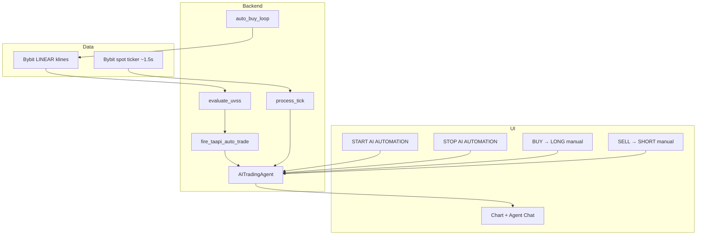

# AI Trading Agent — Complete Trade Policy (Verified)

**Source of truth:** code in `backend/main.py`, `backend/volume_spread_system.py`, `backend/bybit_executor.py`, `frontend/src/App.jsx`.  
**Last verified:** 2026-07-11.

---

## 1. Architecture overview



| Layer | Role |
|-------|------|
| **Signal engine** | `volume_spread_system.evaluate_uvss()` — closed-candle rules only |
| **Execution** | `AITradingAgent.open_trade()` / `_close_single_trade()` |
| **Price feed** | Bybit spot ticker → `process_tick()` every ~1.5s |
| **AI training** | `DATA/*.md` → system prompt for optional `consult_ai_provider()` only (not entry decisions) |

---

## 2. Trade lifecycle (start → end)

### 2.1 Before start

| Step | Behavior |
|------|----------|
| Paper capital | `POST /paper-trading/set-capital` — min **$100**, resets trades + ledger |
| Pair / timeframe | User selects chart pair + TF; backend syncs `timeframe_seconds` |
| Manual trading | **BUY** = LONG, **SELL** = SHORT via `POST /open-trade` — only when automation **OFF** |

### 2.2 Start automation

| Step | Endpoint | Effect |
|------|----------|--------|
| Config modal | `POST /agent/config` | `risk_level_pct`, `max_concurrent_trades`, `daily_profit_target_pct` |
| Safety confirm | `POST /start-bot` | `is_active=True`, `begin_ai_season()`, clears emergency flags |

### 2.3 Entry loop (`auto_buy_loop`)

1. Sleep **5s** (30s/1m), **15s** (5m/15m), **30s** (1h/1D)
2. Skip if `!is_active` or `emergency_triggered`
3. Fetch **≥225** closed klines (Bybit LINEAR)
4. Skip if candle `close_time` already processed (per pair)
5. Run `evaluate_uvss()` → `BUY` / `SELL` / `NO_TRADE`
6. Size via `compute_risk_trade_plan()` (1% balance risk to SL distance)
7. Cap notional at `balance × 1% margin × 100x leverage` (= 100% of equity max)
8. Opposite LONG+SHORT on same pair allowed (no skip, no flip-close)
9. `fire_taapi_auto_trade()` → paper or Bybit TESTNET fill

### 2.4 Open position management

- `process_tick(price)` on every live price update (~1.5s)
- **Auto trades:** stepped profit lock (see §5)
- **Manual trades:** skipped by lock logic; user force-closes via trash icon

### 2.5 Exit paths

| Trigger | Applies to | Action |
|---------|------------|--------|
| Stepped profit lock | Auto only | Market close when retreat to prior lock step (+0.15% / +0.02%) |
| Force close (UI) | Any open trade | `POST /close-trade` |
| STOP automation | All | `POST /emergency-exit` → `_close_all_positions()` + halt |
| Opposite signal on same pair | Auto only | **Allow** — both LONG and SHORT may stay open; each books via profit lock |

### 2.6 Stop automation

- **STOP AI AUTOMATION** → closes **all** positions (auto + manual), `is_active=False`, ends AI season
- No automatic 2.5% portfolio kill-switch (disabled; see §8)

---

## 3. Signal engine — priority (first match wins)

Data: **Bybit LINEAR klines**, **one signal per closed candle**.

| Priority | Module | Patterns | Default R:R |
|----------|--------|----------|-------------|
| 1 | Blue Box displacement | `BB-L`, `BB-S` | 1:2 |
| 2 | VSA + SMC | `L1`–`L4`, `S1`–`S3`, `L5`, `S4` | 1:1 or 1:2 per rule |
| 3 | Marubozu pullback | `MBZ-L`, `MBZ-S` | 1:2 |
| 4 | Standalone momentum | `MOM-L`, `MOM-S` | 1:2 |

### VSA rules (summary)

| Code | Setup | Trend filter | R:R |
|------|--------|--------------|-----|
| L1 | Red exhaustion | Uptrend (200 EMA) | 1:1 |
| L2 | Hammer | Uptrend | 1:2 |
| L3 | Spring (low < L20, vol > 1.5×) | Bypass EMA | 1:2 |
| L4 | Buy absorption | Uptrend | 1:2 |
| L5 | Green body ≥ 2× expected | Bypass EMA | 1:1 |
| S1 | Green exhaustion | Downtrend | 1:1 |
| S2 | Up-thrust | Bypass EMA | 1:2 |
| S3 | Sell absorption | Downtrend | 1:2 |
| S4 | Red body ≥ 2× expected | Bypass EMA | 1:1 |

### Blue Box

- Sweep below **L20** (bull) or above **H20** (bear)
- Displacement on next 1–2 bars (body ≥ expected)
- State persisted per `{pair}|{timeframe}`

### Guards

- Conflicting bull/bear displacement → `NO_TRADE`
- Conflicting VSA long + short same bar → `NO_TRADE`
- `MIN_CANDLES` = **225** (200 EMA + buffers)
- `UVSS_COST_AWARE_ENTRY` = **False** (gate off)

---

## 4. Position sizing & risk

### Auto entries

```
risk_usd     = balance × 1%          (RISK_PCT_PER_TRADE = 0.01)
qty          = risk_usd / |entry − SL|
position_usd = qty × entry
max_notional = balance × 0.01 × 100   (1% margin × 100x)
position_usd = min(position_usd, max_notional)
```

- `balance` = `get_total_portfolio_value()` at entry time
- **SL** used for qty only (`UVSS_SL_EXIT_ENABLED = False`)

### Manual entries

```
margin        = capital_base × 1%
position_size = margin × 100x leverage
```

### Duplicate prevention

1. Same `pair + TF + action + pattern + candle close_time` (10s debounce key)
2. Open auto trade: same pattern + candle, or same pattern + entry within **0.02%**

### Concurrency

- Max open trades = `max_concurrent_trades` (from config modal, default **5**)
- Formula fallback: `round(risk_pct × 1.5)` if frontend omits explicit cap

---

## 5. Exit policy — stepped profit lock

**`AUTO_TRADE_AUTO_EXIT_ENABLED = True`** — auto trades book via stepped profit lock. Manual trades are not auto-closed by lock.

| Constant | Value |
|----------|-------|
| Activation | **+0.15%** gross |
| Lock step | **+0.02%** from peak milestones |
| Sell trigger | Price retreats to **previous lock step** |
| Floor | **Never sell below +0.15%** gross |

UI: open trades stay on top; booked exits appear under **Exited (booked)** in Live Trades.

Opposite signal **does not skip** and **does not close** existing trades — both sides may be open.

### Legacy: disable auto lock

Set `AUTO_TRADE_AUTO_EXIT_ENABLED = False` to keep positions open until force-close / STOP.

| Constant | Value |
|----------|-------|
| Activation | **+0.15%** gross |
| Lock step | **+0.02%** from peak milestones |
| Sell trigger | Price retreats to **previous lock step** |
| Floor | **Never sell below +0.15%** gross |

### Example

```
Peak +0.20% → locks +0.22% → +0.24% → sell on retreat to +0.22%
Peak +0.15% → locks +0.17% → +0.19% → sell on retreat to +0.17%
```

### SL / TP fields on trade record

| Field | Purpose |
|-------|---------|
| `sl_price` | Sizing + logs only — **no auto SL exit** |
| `tp_price` | Reference R:R target — **not used for auto exit** |

Fees: taker **0.055%** per side; trade list shows **net %** primary, gross subtitle.

---

## 6. Execution modes

| Mode | Capital source | Orders |
|------|----------------|--------|
| **PAPER_TRADING** | Simulated ledger (`starting_capital`, default $1000) | Print-only fills |
| **LIVE_TRADING** | Bybit **mainnet** equity (read-only for sizing) | Still via **TESTNET** `BybitAgent` if keys set |

- Mainnet keys: `settings_store` — balance sync only
- Testnet keys: `BYBIT_TESTNET_API_KEY/SECRET` — real linear perp market orders
- Category: **linear** (USDT perpetual)
- Without testnet keys: signals fire, orders cannot execute

---

## 7. Manual controls

| UI | API | When | Action |
|----|-----|------|--------|
| BUY | `POST /open-trade` `{side:"LONG"}` | Automation OFF | Open manual LONG |
| SELL | `POST /open-trade` `{side:"SHORT"}` | Automation OFF | Open manual SHORT |
| Trash icon | `POST /close-trade` | Anytime | Force close one trade |
| STOP | `POST /emergency-exit` | Anytime | Close all + halt automation |

Legacy: `POST /manual-sell` still closes best manual trade (UI no longer uses it).

---

## 8. Portfolio & PnL (header)

| Metric | Formula |
|--------|---------|
| **Total Capital** | `total_portfolio_value` = cash ledger + unrealized net |
| **Trade Value** | Sum of open `position_size` (notional exposure) |
| **Daily Profit** | `total_value − starting_capital` (session lifetime, not calendar day) |
| **AI Season Profit** | `total_value − ai_season_start_capital` while automation ON |

**Do not subtract** trade notional from total capital (fixed 2026-07-11).

### Daily profit target

- Set in Agent Instructions modal (`daily_profit_target_pct`)
- When reached: **new auto entries halted**; open trades still managed by profit lock
- `0` = disabled

---

## 9. Agent configuration modal

| Field | Maps to | Effect |
|-------|---------|--------|
| Risk % | `risk_level_pct` + `max_concurrent_trades` | Max stacked positions |
| Capital profit of the day | `daily_profit_target_pct` | Halt new entries when hit |
| (implicit) | `daily_target_reached` | Reset on START / config change |

---

## 10. Safety & emergency

| Feature | Status |
|---------|--------|
| Auto SL exit | **Disabled** |
| Auto 2.5% portfolio kill | **Disabled** (`trigger_emergency_exit` never called) |
| Manual STOP | **Active** — closes all positions |
| `emergency_triggered` | Blocks **new** entries after stop until cleared |
| WebSocket reconnect | Agent state preserved |

---

## 11. AI agent training corpus (not UI)

Loaded into AI provider system prompt via `load_system_role_text()`:

| File | Content |
|------|---------|
| `DATA/SYSTEM_ROLE_AND_IDENTITY.md` | Note 1 — HTF zones, CHoCH/BOS, mitigation |
| `DATA/SMC_ICT_MARKET_STRUCTURE.md` | Note 2 — TBS/TWS, OB sweep, ICT |
| `DATA/FIB_LIQUIDITY_CONFIRMATION.md` | Note 3 — Fib 0.5–0.618, BSL/SSL, CRT+TBS |
| `DATA/TREND_REVERSAL_PREMIUM.md` | Note 4 — Premium sell, weak candles, expansion |

Condensed index: `DATA/AI_AGENT.txt`  
Operational spec: `DATA/TRADING POLICIES.txt`

**Important:** Training docs guide optional AI confirmation only. **Live entries** follow `evaluate_uvss()` code rules.

---

## 12. Constants reference

| Constant | Value | File |
|----------|-------|------|
| `MIN_CANDLES` | 225 | `volume_spread_system.py` |
| `RISK_PCT_PER_TRADE` | 0.01 (1%) | `volume_spread_system.py` |
| `UVSS_SL_EXIT_ENABLED` | False | `volume_spread_system.py` |
| `PROFIT_LOCK_ACTIVATION` | 0.15% | `main.py` |
| `PROFIT_LOCK_STEP` | 0.02% | `main.py` |
| `margin_pct` | 0.01 | `main.py` |
| `leverage` | 100 | `main.py` |
| `taker_fee_pct` | 0.055% | `main.py` |
| `starting_capital` (paper) | 1000.0 | `main.py` |
| `SL_BUFFER_PCT` | 0.1% | `volume_spread_system.py` |
| `EMA_FAST` / `EMA_SLOW` | 50 / 200 | `volume_spread_system.py` |
| `SWEEP_LOOKBACK` | 20 | `volume_spread_system.py` |

---

## 13. Legacy / stale (do not use for live behavior)

| Item | Status |
|------|--------|
| `STRATEGY.md` (old TAAPI sections) | Superseded by this document |
| `DATA/AUTOMATION.txt`, `DATA/FRONT END.txt` | Old 0.07% lock + auto 2.5% kill — outdated |
| `taapi_scanner.evaluate_trade()` | Not called from `auto_buy_loop` |
| `AUTO_TRADE_CAPITAL_PCT = 0.10` | Dead code in `main.py` |
| `POST /manual-sell` | Legacy; UI uses SHORT open instead |

---

## 14. File map

```
backend/main.py              — Agent, loops, APIs, profit lock
backend/volume_spread_system.py — Signal engine (UVSS)
backend/bybit_executor.py      — TESTNET order placement
backend/trading_policy.py    — Cost-aware (disabled for UVSS)
frontend/src/App.jsx           — Capital display, manual buttons
frontend/src/hooks/usePortfolio.js — WS portfolio feed
DATA/TRADING POLICIES.txt    — Short operational spec
DATA/AI_AGENT.txt            — Training index
TRADE_POLICY.md              — This document (authoritative)
```
